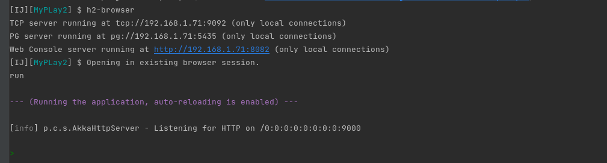
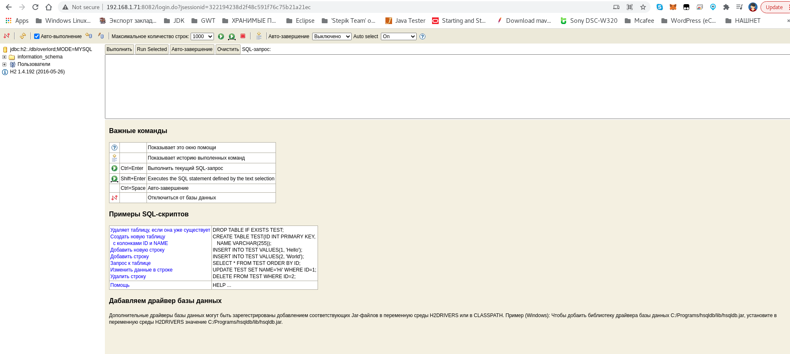
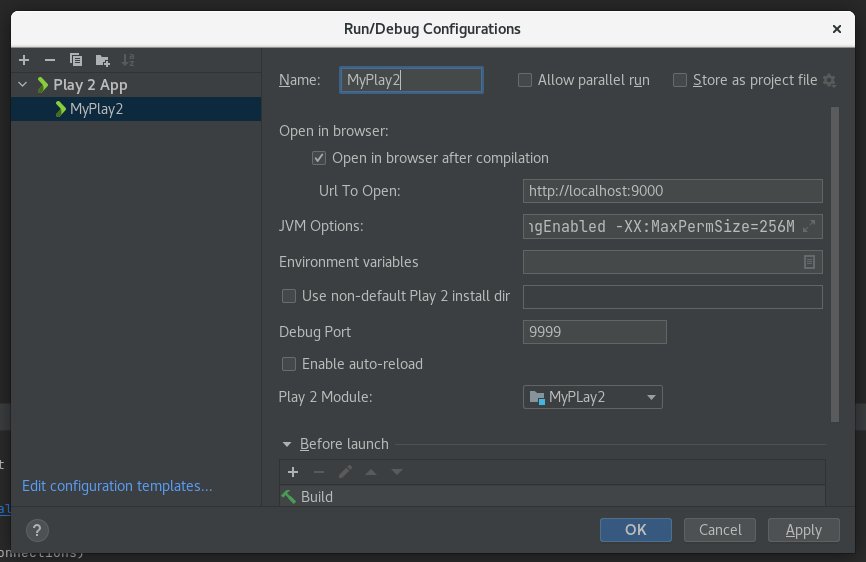

# Подключение к локальной базе данных h2 в play framework

* https://coderoad.ru/32545697/Подключение-к-локальной-базе-данных-h2-в-play-framework
* https://www.playframework.com/documentation/2.8.x/Developing-with-the-H2-Database
* **(** https://www.titanwolf.org/Network/q/98c4d84d-f03d-415f-b4bf-5f8680bfe13e/y **)**

# Creating forms on your Play application - Part 1

* https://pedrorijo.com/blog/play-forms/

---

[GitHub * Personal access tokens](https://mail.google.com/mail/u/0/?tab=rm&ogbl#inbox/KtbxLwgswrfxtLZJbFzLlPHzglccGQBXXV)

---

* [Community contributed extensions: Modules repository](https://www.playframework.com/modules)
* [H2 database](https://www.playframework.com/documentation/2.8.8/Developing-with-the-H2-Database#H2-database)
* [Akka HTTP configuration](https://developer.lightbend.com/docs/telemetry/current//instrumentations/akka-http/akka-http-configuration.html)
* [How to compile, run, and package a Scala project with SBT](https://alvinalexander.com/scala/sbt-how-to-compile-run-package-scala-project/)

* https://0x1.tv/Scala,_Play_Framework_и_SBT_для_быстрого_прототипирования_и_разработки_веб-приложений_(Антон_Кириллов)
* https://eax.me/play-framework/
* http://blogger.sapronov.me/2014/04/play-framework.html